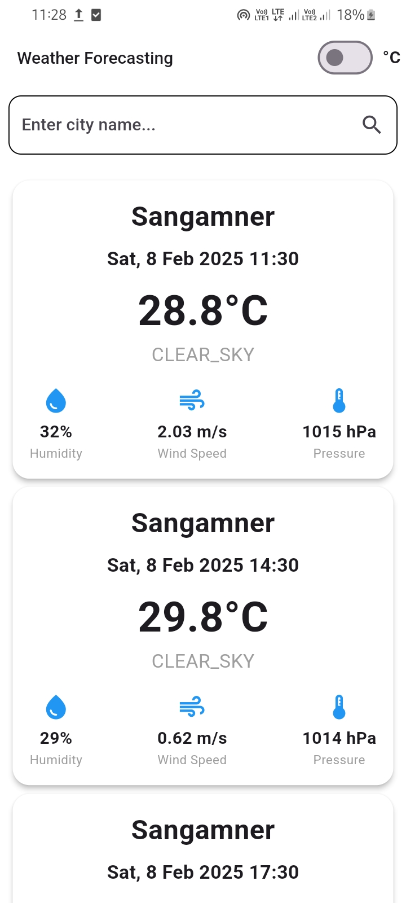

# Weather Forecasting App

## 🌦 Overview
The **Weather Forecasting App** is a Flutter-based application that provides real-time weather information based on the user's location or a searched city. The app fetches weather data using the **OpenWeather API** and displays essential details like temperature, weather conditions, and an icon representation of the weather.

## 🚀 Features
- 🌍 Get weather data based on the current location.
- 🔍 Search for weather conditions by city name.
- 🌡 Toggle between Celsius (°C) and Fahrenheit (°F).
- 🌤 Displays weather icons based on conditions.
- 💾 Saves the last searched city and its temperature.
- 🛠 Simple, clean UI with Material Design.

## 📸 Screenshot  


## 🛠 Tech Stack
- **Flutter** (Dart)
- **Cubit (Flutter Bloc)** for state management
- **Geolocator** for fetching user location
- **OpenWeather API** for weather data

## 📦 Dependencies
Ensure you have the following dependencies added to your `pubspec.yaml` file:
```yaml
  dependencies:
    flutter:
      sdk: flutter
    flutter_bloc: ^8.1.3
    geolocator: ^10.1.0
    http: ^0.13.5
    lottie: ^3.2.0
    shared_preferences: ^2.2.2
```

## 🔧 Installation & Setup
### Prerequisites
- Flutter SDK installed ([Install Flutter](https://docs.flutter.dev/get-started/install))
- API Key from OpenWeather ([Get API Key](https://home.openweathermap.org/api_keys))

### Steps to Run
1. **Clone the repository**
   ```sh
   git clone https://github.com/sagar-81/weather_forecasting
   cd weather_forecasting
   ```
2. **Install dependencies**
   ```sh
   flutter pub get
   ```
3. **Add your OpenWeather API Key**
   - Navigate to `lib/constants.dart`
   - Replace `YOUR_API_KEY` with your actual API key
   ```dart
   class AppString {
     const String apiKey = "YOUR_API_KEY";
   }
   ```
4. **Run the app**
   ```sh
   flutter run
   ```

## 📜 Folder Structure
```
weather_forecasting/
│── lib/
│   │── main.dart
│   │── constants.dart
│   │── screen/
│   │   ├── home.dart
│   │── bloc/
│   │   ├── get_temp_cubit.dart
│   │   ├── get_temp_state.dart
│   │── model/
│   │   ├── weather_model.dart
│   │── storage/
│   │   ├── local_storage.dart  
│── assets/
│── pubspec.yaml
```

## 🛠 API Integration
The app fetches weather data using the **OpenWeather API**. Below is an example API request:
```sh
https://api.openweathermap.org/data/2.5/forecast?q=London&appid=YOUR_API_KEY&units=metric
```
- `q` → City name
- `appid` → API Key
- `units=metric` → Temperature in Celsius (Use `imperial` for Fahrenheit)

## 🔥 Future Enhancements
- 📊 More detailed weather stats (humidity, wind speed, etc.).

## 🤝 Contributing
Pull requests are welcome! If you'd like to contribute, please follow these steps:
1. Fork the repository
2. Create a new feature branch (`git checkout -b feature-branch`)
3. Commit your changes (`git commit -m 'Add new feature'`)
4. Push to the branch (`git push origin feature-branch`)
5. Create a Pull Request

---
🚀 **Developed with ❤️ using Flutter**

# wether_app

# wether_app

